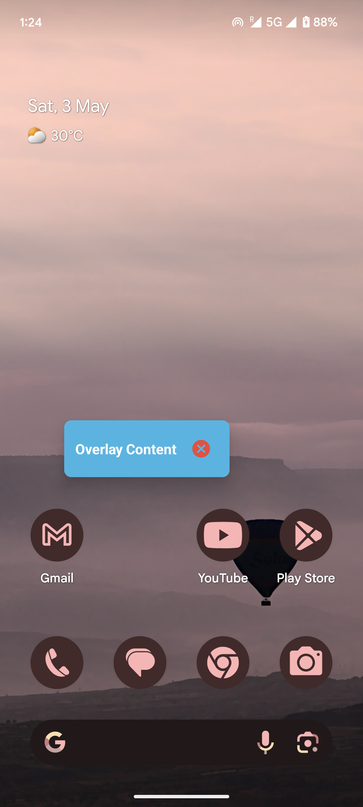

# OverlayView

This is a simple Android example that demonstrates how to display a custom overlay view without using an Activity. Useful for creating floating views like tooltips, in-app tutorials, or system overlays.

## Features

- Show overlay without launching an Activity
- Useful for system-level UI or floating help bubbles
- Lightweight and easy to use

## Screenshots

For a detailed explanation of how this works under the hood,  check out this article:
[Creating UI Without Activity in Android: A Deep Dive into Overlay Views](https://medium.com/@avinashm720/creating-ui-without-activity-in-android-a-deep-dive-into-overlay-views-70bbee1b5d55)
